# Predicting Employee Attrition 

Employee attrition is a significant issue that impacts both the individual's quality of life, and work performance. Detecting individuals who are close to attrition, or are already experiencing it, can be used to prevent deterioration of work performance and life quality. 

Having a tool for predicting attrition, HR departments and managers can undertake timely actions to help the employee, offer to have additional free time, switch task, address career concerns, etc. Thus, the proposed analysis is rather actual and can help to improve performance in many companies. 

## Project Set Up and Installation

In order to run the project in AzureML, please do the following:
- upload files **automl.ipynb** and **hyperparameter_tuning.ipynb** to the AzureML Notebooks section
- upload folders **train** and **score** with all included files to the same directory in the Notebooks section 
- open files **automl.ipynb** and **hyperparameter_tuning.ipynb** in the notebook editor
- press "Run all cells" button for **hyperparameter_tuning.ipynb** file; wait for completion
- press "Run all cells" button for **automl.ipynb** file; wait for completion
-- if additional authorization is required, please follow the insructions displayed in the Notebook output 
-- after both runs complete, you can also explore the dataset, registered model, deployed model and REST endpoint in AzureML UI 

## Dataset

### Overview

The dataset is retrieved from https://www.kaggle.com/alhassanabdelglil/classification

It contains data about 1,470 employees - their demographic, personal and professional characteristics, workplace characteristics, as well as information about employee attrition. "Attrition" is the target column used for train and test purposes.

To avoid access issues, I have uploaded an unpacked copy of the dataset into own Github account, and loaded the dataset to AzureML from this copy.

### Task

The purpose of the model is to assess whether an employee is experiencing attrition or not, based on employee's personal and professional characteristics. This task is a classification task.

I will use all available features, since any of them may contribute to the employee's condition and lead to attrition. The only exception are two columns ("EmployeeNumber", "EmployeeCount") that do not characterize an employee, and are present just for reference purposes. 

Categorical columns ("BusinessTravel", "Department", "EducationField", "JobRole", "MaritalStatus") are encoded using one hot encoder. In addition to existing features, AutoML featurization is used to enhance the model. 

### Access

The raw dataset is stored in the Github account, and available via the following link:
https://raw.githubusercontent.com/olgagnatenko13/nd00333-capstone/master/dataset/Dataset_for_Classification.csv 
It is then loaded as a tabular (AML) dataset, and registered in the workspace with "attrition-analysis" key.

## Automated ML

### AutoML settings

- experiment_timeout_minutes = 20: to avoid virtual machine timeout, we limit AutoML experiment time 
- max_concurrent_iterations = 5: we limit the number of parallel iterations to optimize resource use 
- task = "classification": the selected problem is a binary classification task 
- primary metric - accuracy (as in the hyperparameter experiment) for compatibility purposes, and due to the fact that correct identification of positives and negatives is equally important 
- label_column_name = "Attrition": the data about employee attrition are located in column "Attrition"
- n_cross_validations = 3: we specifically indicate to use cross-validation approach instead of default train-test split, and select three cross-validation folds
- debug_log = "automl_errors.log": place automl logs into a file for future analysis 
- featurization = "auto": allow AutoML to perform featurization based on the task type 
- enable_early_stopping: True: apply early termination if the score is not improving in the long-term perspective - this option is selected to make the run faster 

### AutoML Configuration

- training_data = tabular_ds_train: we train the model on the "train" part of the dataset
- compute_target = cluster_name: indicate the compute to run the experiment 

### Results

#### Three best models:

1. Algorithm: StackEnsemble, accuracy: **0.8566**
2. Algorithm: VotingEnsemble, accuracy: **0.8557**
3. Algorithm: XGBoostClassifier (with prior SparseNormalizer), accuracy: **0.8548**

Ensembles show the best results, as expected, since they combine different algorithms. XG Boost also shows compatible results, which is also expected, as XG Boost is one of the most powerful classification algorithms.  

The results can be further improved in the future by increasing the experiment timeout setting (since the experiment was terminated due to timeout). 

#### Top 10 features, according to best model 
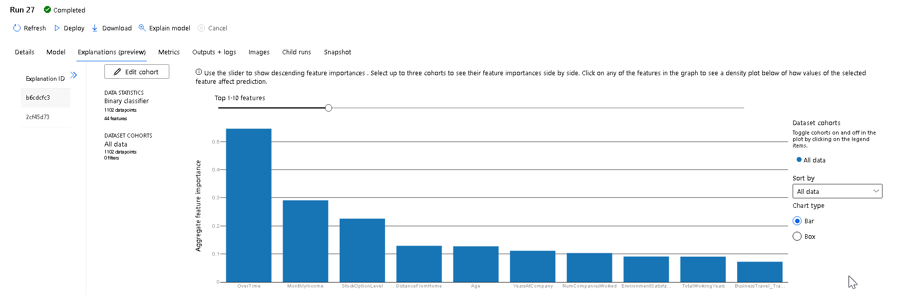

#### Screenshots:

1. AutoML Run Details
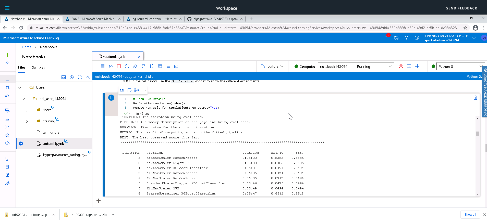

2. AutoML - completed run 
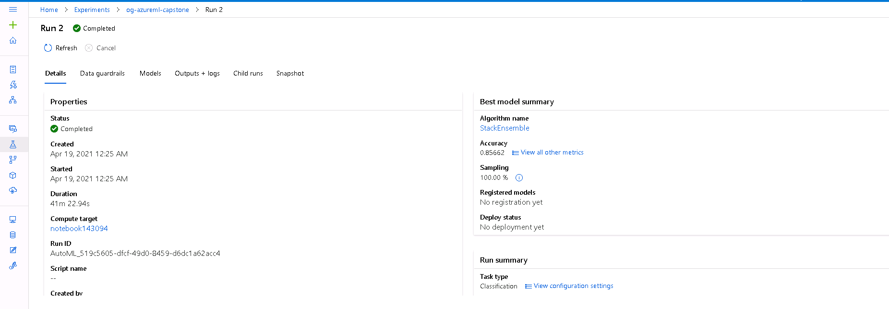

3. AutoML models 
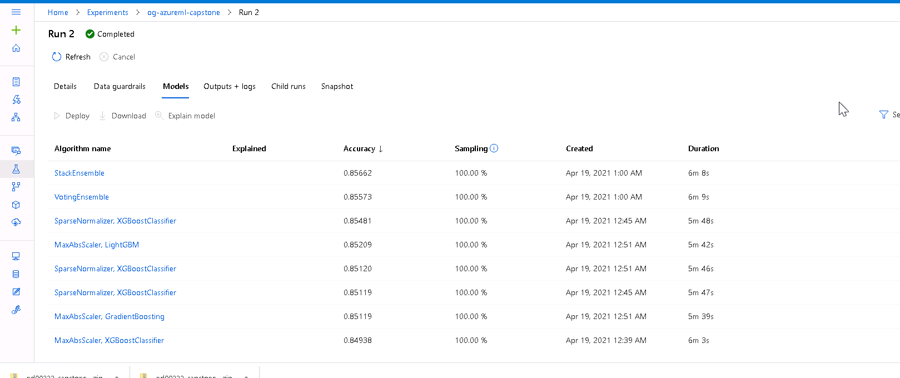

4. AutoML model details
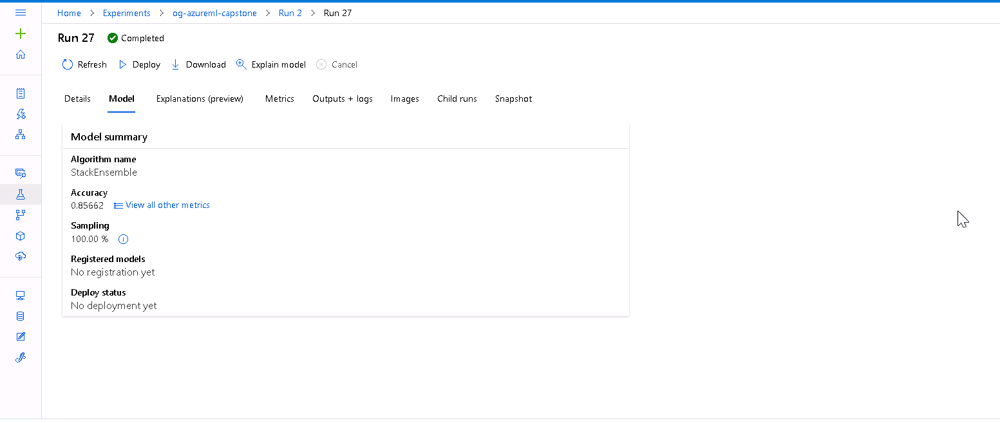

5. AutoML model metrics 
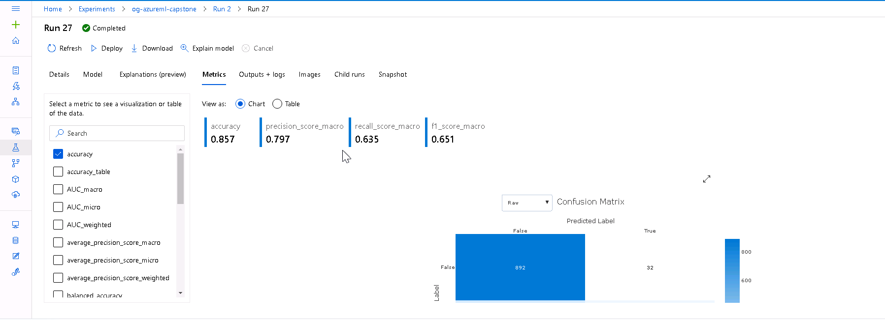

6. AutoML model confusion matrix 
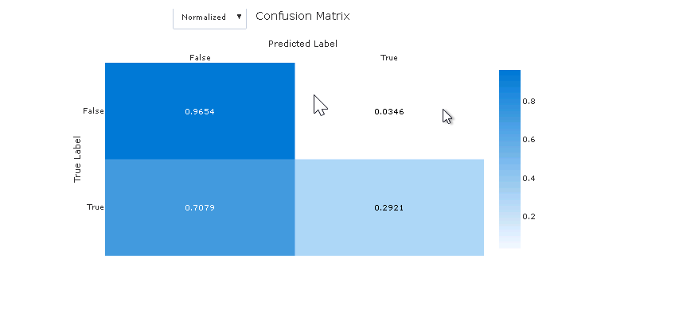

7. AutoML ensemble components 
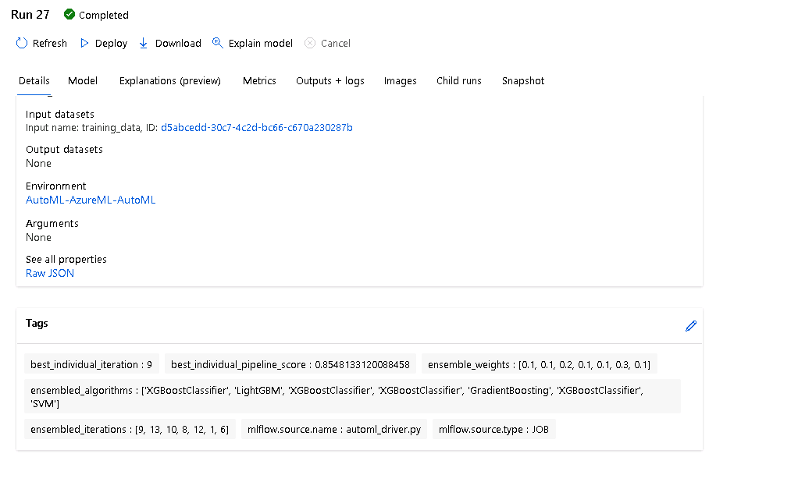

## Hyperparameter Tuning
### Model
The selected model (algorithm) is SVM. It is known as one of the most efficient classification algorithms.
SVM was selected due to the following benefits:
- it can work with high-dimensional data
- it is relatively memory efficient
- it generalizes well, performs well on test datasets and is not prone to overfitting 
- deals well with bias and outliers 

### Hyperparameters
- Kernel: RBF - is generally considered the best choice for generic problems
- Regularization: selected from a set of values (0.01, 0.05, 0.1, 0.5, 1, 5, 10, 50, 100) - for SVM, this parameter desribes the "margin" of the hyperplane separating the classes
- Gamma: selected from a set of values (1, 0.5, 0.1, 0.05, 0.01, 0.005, 0.001) - defines the influence of distance between the data point and the hyperplane, with smaller values meaning that more distant data points are given more weight in evaluation.

### Termination policy
BanditPolicy allows to set up a relatively "aggressive" termination approach, and therefore allows to save VM resources

### Sampling
Grid sampling is used since both hyperparameters are selected from a finite list of values, and each value has its own impact on model performance

### Config settings 
- hyperparameter_sampling = param_sampling, policy = early_termination_policy: set the previously defined sampling approach and early termination policy
- primary_metric_name = "Accuracy": we will use Accuracy to evaluate models, since correctly detecting both classes is equally important for us
- primary_metric_goal = PrimaryMetricGoal.MAXIMIZE: Accuracy should be maximized 
- max_total_runs = 65: limit total runs to save resources 
- max_duration_minutes = 45: limit duration to save resources and avoid timeout 
- source_directory = source_directory, and script = "train.py": indicate the location of the training script
- compute_target = cluster: set the compute cluster for the run 
- environment = environment: set the enviroment for the run 

### Results

#### Three best models:

1. Regularization = **50**, gamma = **0.05**, accuracy = **0.7745**
2. Regularization = **50**, gamma = **0.1**, accuracy = **0.7391**
3. Regularization = **100**, gamma = **0.1**, accuracy = **0.7391**

We can see that all best models represent a similar combination of hyperparameters: regularization between 50 and 100, gamma between 0.05 and 0.1. Both values represent a reasonable balance between variance and bias (for regularization) and between the importance of far and close data points (gamma). Due to the balanced selection of hyperparameter values, these models performed better than others.

As we can see, the accuracy is moderate, so in the future the model can be further improved. One direction of improvement is trying other SVM kernel types for this task. 

#### Screenshots

1. Hyperparameter tuning - Run Details 
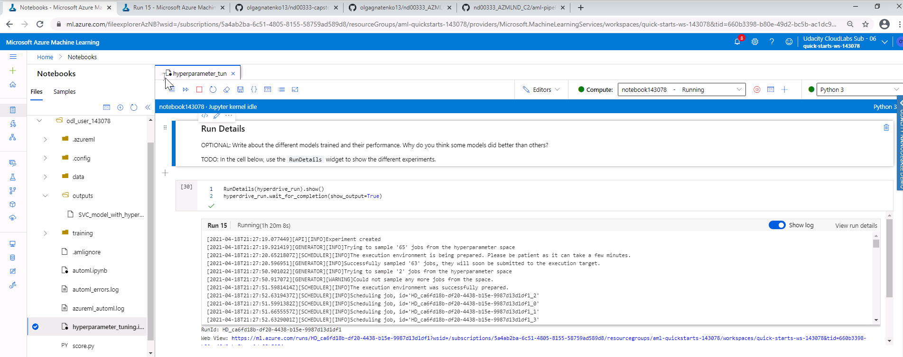

2. Hyperparameter tuning - completed run 
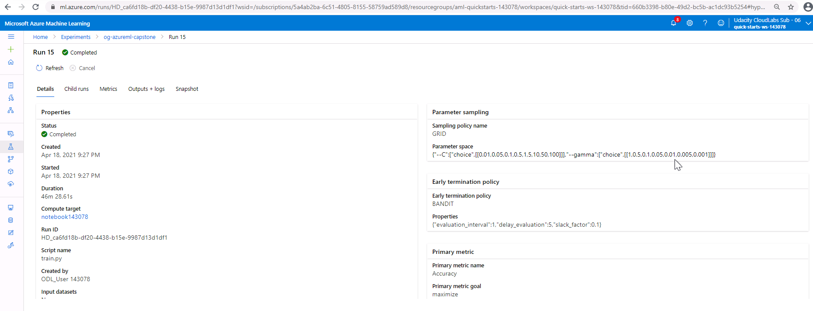

3. Hyperparameter tuning - accuracy 
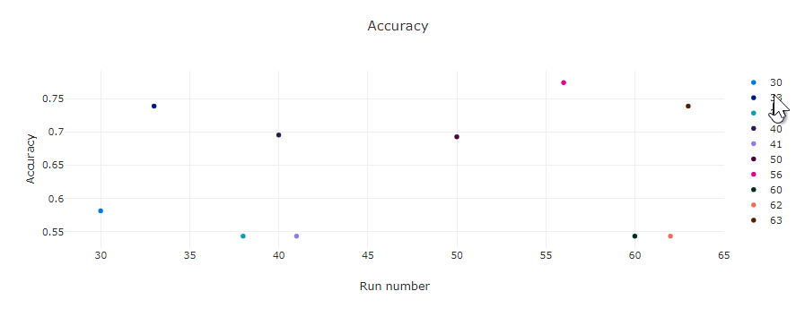

4. Hyperparameter combinations
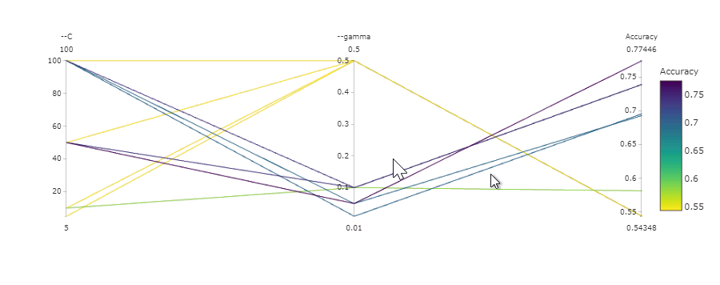

5. Hyperparameter tuning - best run 
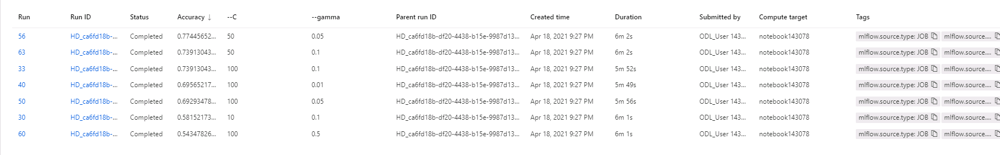

6. Hyperparameter tuning - best run details
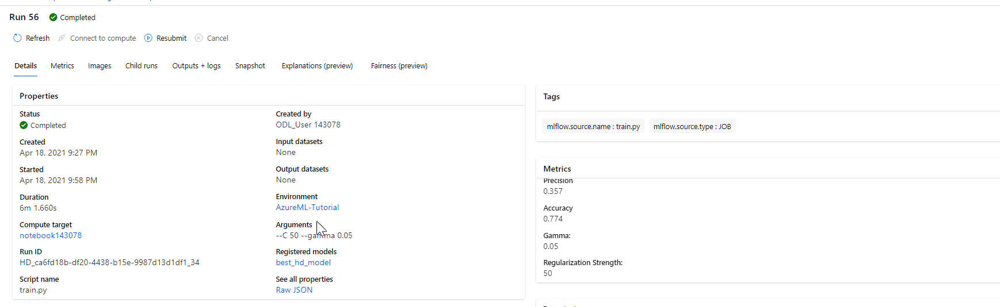

7. Hyperparameter tuning - best run metrics


## Model Deployment

### Deployed Model 
The deployed model name is "attrition-model". It is available as a REST endpoint, and displayed in Endpoints in Azure Ml Studio.

Endpoint URL: http://7ab698bf-34cb-4ab8-be4d-7b813904afdb.southcentralus.azurecontainer.io/score
Authentication token (key): U1xiKqV2SrekUNE5cxpDqgXKUq7AFMWw


### Querying the Endpoint
To consume the model, it is necessary to send a POST request with the following JSON in the body:
```javascript
{
    data: [
        <list of datapoints provided to the model for prediction>
    ]
}
```

The response is also a JSON of the following format:
```javascript
{
    data: [
        <list of "Yes" or "No" attrition values for each data point provided in the array>
    ]
}
```

### Sample Input 
```javascript
{
  "data": [
    {
      "Age": 41,
      "Attrition": "Yes",
      "BusinessTravel": "Travel_Rarely",
      "DailyRate": 1102,
      "Department": "Sales",
      "DistanceFromHome": 1,
      "Education": 2,
      "EducationField": "Life Sciences",
      "EmployeeCount": 1,
      "EmployeeNumber": 1,
      "EnvironmentSatisfaction": 2,
      "Gender": "Female",
      "HourlyRate": 94,
      "JobInvolvement": 3,
      "JobLevel": 2,
      "JobRole": "Sales Executive",
      "JobSatisfaction": 4,
      "MaritalStatus": "Single",
      "MonthlyIncome": 5993,
      "MonthlyRate": 19479,
      "NumCompaniesWorked": 8,
      "OverTime": "Yes",
      "PercentSalaryHike": 11,
      "PerformanceRating": 3,
      "RelationshipSatisfaction": 1,
      "StockOptionLevel": 0,
      "TotalWorkingYears": 8,
      "TrainingTimesLastYear": 0,
      "WorkLifeBalance": 1,
      "YearsAtCompany": 6,
      "YearsInCurrentRole": 4,
      "YearsSinceLastPromotion": 0,
      "YearsWithCurrManager": 5
    }
  ]
}
```

### Sample Response 
```javascript
{
    "data": {
        ["Yes"]
    },
    "message": "Successfully classified attrition"
}

```

## Screen Recording
Screencast is available via the following link: 

*TODO* Provide a link to a screen recording of the project in action. Remember that the screencast should demonstrate:
- A working model
- Demo of the deployed  model
- Demo of a sample request sent to the endpoint and its response

